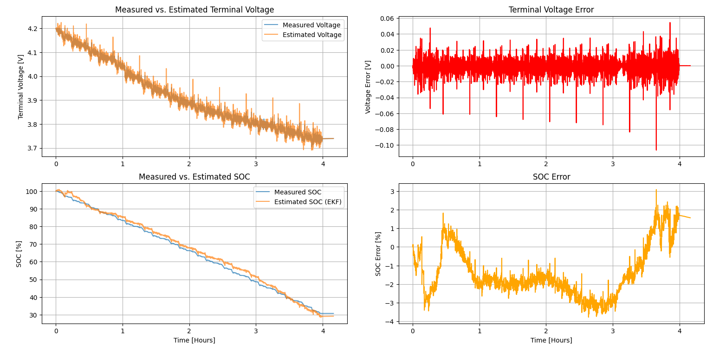
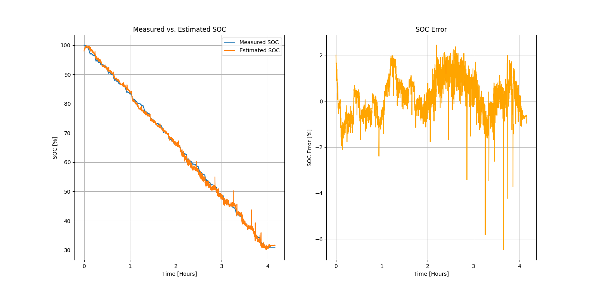
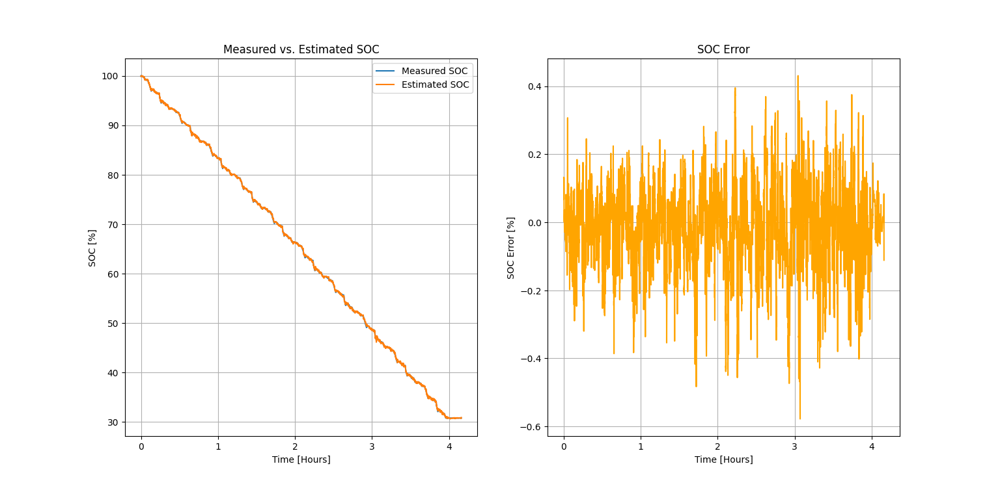

# Battery State of Charge prediction using different estimation techniques

[](https://opensource.org/licenses/MIT)
[](https://www.python.org/downloads/release/python-3100/)
[](https://www.tensorflow.org/)
[](https://scikit-learn.org/)
[](https://pandas.pydata.org/)
[](https://numpy.org/)
[](https://matplotlib.org/)
[](https://scipy.org/)

## Table of Contents

- [Description](#description)
- [Key Features](#key-features)
- [Getting Started](#getting-started)
  - [Dataset](#dataset)
  - [Setup](#setup)
- [Usage](#usage)
- [Results](#results)
- [Credits](#credits)
- [References](#references)

## Description 

This project focuses on State of Charge (SoC) estimation for lithium-ion batteries using a combination of model based and data driven techniques. The study evaluates the performance of Extended Kalman Filter (EKF), XGBoost, and Feedforward Neural Network (FNN) models for accurate SoC prediction. 

All the simulations were conducted using the Turnigy graphene battery datasets, which provide real-world cycling and degradation data. Through this repo, I explore advanced battery SoC estimation using extended kalman filter, machine learning and deep learning techniques, mainly for me to expand on experience learnt in career + courses + self-learning while identifying areas for self-improvement in my own knowledge and skills.

## Key Features

- **Multiple SoC Estimation Techniques :**
Implements and compares EKF, XGBoost, and Feedforward Neural Network (FNN) approaches for battery State of Charge estimation.

- **Comprehensive Preprocessing Pipeline :**
Includes data cleaning, feature extraction, normalization, and dataset preparation tailored for both model-based and data-driven methods.

- **Performance Evaluation & Visualization :**
Provides metrics such as RMSE/MAE and includes plots for model comparison, prediction accuracy, and error profiles.

## Getting Started

### Dataset

This project uses the open source [Turnigy Graphene 5000mAh 65C Li-ion Battery Data 1](https://data.mendeley.com/datasets/4fx8cjprxm/1) [1]. The included tests datasets were performed at McMaster University in Hamilton, Ontario, Canada by Dr. Phillip Kollmeyer and Dr. Skells Michael.

### Setup

- Install the dependencies

    ```bash
    pip install -r requirements.txt
    ```

- **Change the PATH of datasets in the code**

## Usage

**Running EKF**

```bash
cd EKF
python main.py
```

**Running FNN**

```bash
cd FNN
python main.py
```
**Running XGBoost**

```bash
cd XGBoost
python main.py
```

## Results and Performance Evaluation

### 🔹 EKF-Based SoC Estimation



- **RMSE:** `3.03 %`

---

### 🔹 FNN-Based SoC Estimation



- **RMSE:** `1.16 %`

---

### 🔹 XGBoost-Based SoC Estimation



- **RMSE:** `0.16 %` 


## Credits

This project uses the following open-source libraries, frameworks, and algorithms:

- **Extended Kalman Filter (EKF)** – Model-based state estimation algorithm 
- **[TensorFlow](https://www.tensorflow.org/)** – Deep learning framework used for neural network implementation  
- **[XGBoost](https://xgboost.ai/)** – Gradient boosting framework used for machine learning model development  
- **[Scikit-learn](https://scikit-learn.org/)** – Machine learning utilities for model evaluation and preprocessing  
- **[NumPy](https://numpy.org/)** – Numerical computing library  
- **[Pandas](https://pandas.pydata.org/)** – Data manipulation and analysis  
- **[Matplotlib](https://matplotlib.org/)** – Plotting and data visualization  
- **[SciPy](https://scipy.org/)** – Scientific computing and numerical algorithms


## References

[1] Kollmeyer, Phillip; Skells, Michael (2020), “Turnigy Graphene 5000mAh 65C Li-ion Battery Data”, Mendeley Data, V1, doi: 10.17632/4fx8cjprxm.1


